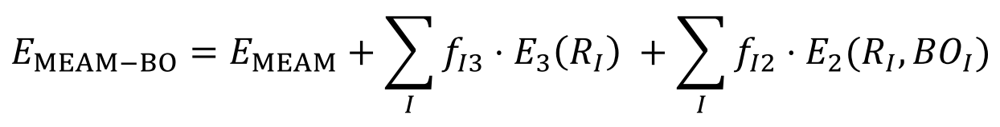

# MEAM-BO
Modified Embedded Atom Method with Bond Order (MEAM-BO) implementation in LAMMPS

This package implements the MEAM-BO force field as a LAMMPS pair style based on 
the MEAM/C (7Aug2017 version) package where bond order calculations are added. 

Implementation by Sungkwang Mun, Ricolindo L Carino, and Michael Baskes  
 sungkwan@cavs.msstate.edu, carino@cavs.msstate.edu, baskes@bagley.msstate.edu  
 Center for Advanced Vehicular Systems  
 Mississippi State University, MS 39762  
 
## Thoery

The challenge in the current MEAM formalism is a lack of capability to distinguish bond order in different materials, such as acetylene (bond order: 3), ethylene (2), graphene (4/3) and benzene (3/2). To solve this issue, additional energy terms are added to the original MEAM energy as follows.



where E_MEAM is the energy from the original MEAM formalism, f_Ibond is a function that gives fractional energy with respect to the bond I, E_bond is the increment of energy due to the bond saturation, and R_I is the bond length between two atoms. It should be noted that E_2 deals with the double bond and the bond order less than two such as graphene and benzene. See Ref. [1] for the detail.

 
## Installation
1. Copy User-MEAMBO folder to the LAMMPS src/ folder.
2. Type "make yes-user-meambo" in the command line to enable this package.
3. Rest of the procedures are the same as specified in the following page. https://lammps.sandia.gov/doc/Build_make.html

## How to use
In your LAMMPS input script, specify  

  `pair_style meambo`  
  `pair_coeff * * parameter_1 el1 ... parameter_2 el1 ... bond_order_parameter_2`  
  
to enable the use of this implementation. The parameter files used with 
pair_style meam/c are usable by pair_style meambo; however, the following
keyword=value lines, for example (CH binary system), should be added to 
paramter_2 file for the bond order calculation (as well as van der Waals interaction ):  

```
ntypBC=1           // number of elements that have unsaturated bonds
rcutBC(1)=3.3      // cutoff radius for 1st element for bond order calculation 
rcutBC(2)=2.4      // cutoff radius for 2nd element for bond order calculation 
vdW_form = 1       // selection parameter for form of vdW function
                   // 0: no vdW effect, 1: 9-6 Lenard Jones equation
evdW_96LJ(1)=0.435 // epsilon (energy) parameter for 1st element in 9-6 LJ
evdW_96LJ(2)=0     // epsilon (energy) parameter for 2nd element in 9-6 LJ 
svdW_96LJ(1)=3.01  // sigma (distance) paramters for 1st element in 9-6 LJ 
svdW_96LJ(2)=0     // sigma (distance) paramters for 2nd element in 9-6 LJ
```

Replacing the bond order file name with NULL such as the following 

`pair_coeff * * parameter_1 el1 ... parameter_2 el1 ... NULL`  

will execute the original MEAM calculation without the bond order calculation 
so that the results will be exactly the same as those of meam/c.

## Bond order paramter example
The bond file contains the bond information, for example:
```
# elt_i1   elt_i2   bond    Z(0)   Z(1)   beta0    beta1    beta2   beta3   p0     p1     p2     p3
# double bond: e2a_0(1:3), e2a_1(1:3), e2a_2(1:3), re2a(1:3)
# triple bond: eb3(1:3), re3

'C'     'C'      2       3     0     5       1       4.5     1.2     1       1       1       1.2     
-1.296    -4.618    -14.21   
-0.632    -4.462    21.841   
0.299     -5.452    55.653   
1.3396    -0.0959   0.0364    

'C'     'C'      3       2     0     5       5       4.5     0.46    1       1       1       1       
-3.647          -3.03           -13.003         1.203           
```


## Other differences compared with meam/c package
1. New reference structures are added  
  a. ch4: methane-like structure only for binary system  
  b. dia3: diamond structure with primary 1NN and secondary 3NN inteation  
  c. tri: H2O-like structure that has an angle  
	e. zig: zigzag structure with a uniform angle   
  d. lin: linear structure (180 degree angle)  
2. tri, zig, and lin reference structures require angle information (in degree) in the paramter_2 file such as the following.  
`theta = 109.5`

## Future plan
1. Performance optimization
2. Another method for vdW interaction will be added, i.e. DFT-D3 function (See Ref. [2] for detail)
3. Equation will be slightly modified to treat different kinds of unsaturated 
bonds such as C-O and N-O. However, the results with the same bond parameter 
will not be affected.


## References
[1] Mun, S.; Bowman, A. L.; Nouranian, S.; Gwaltney, S. R.; Baskes, M. I.; Horstemeyer, M. F. Interatomic Potential for Hydrocarbons on the Basis of the Modified Embedded-Atom Method with Bond Order (MEAM-BO). J. Phys. Chem. A 2017. https://doi.org/10.1021/acs.jpca.6b11343.
[2] Dickel, D.; Gwaltney, S. R.; Mun, S.; Baskes, M. I.; Horstemeyer, M. F. A Dispersion-Corrected Modified Embedded-Atom Method Bond Order Interatomic Potential for Sulfur. The Journal of Physical Chemistry A 2018. https://doi.org/10.1021/acs.jpca.8b07410.

